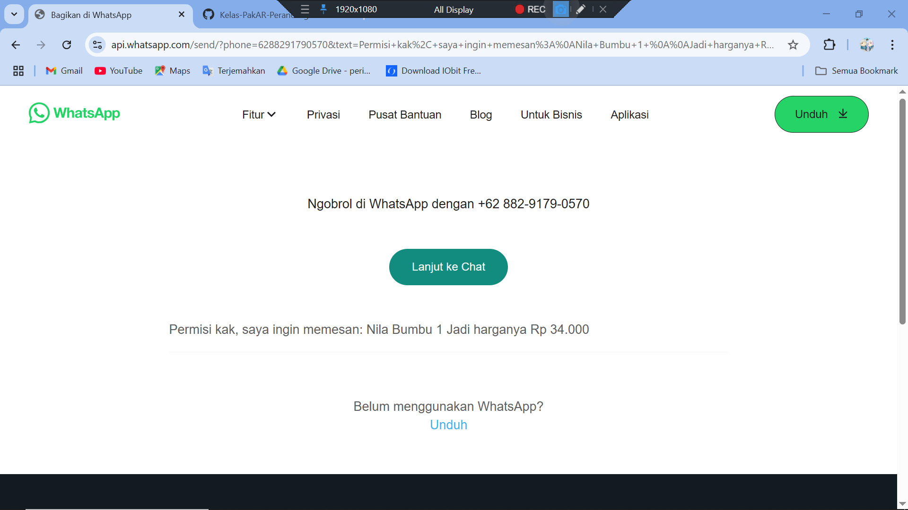

## Proses Pengerjaan

Proyek ini merupakan website toko online sederhana yang dibuat menggunakan PHP untuk backend dan CSS untuk tampilan antarmuka.

Awalnya, website dikembangkan secara lokal menggunakan XAMPP dan phpMyAdmin untuk mengelola database. Setelah semua fitur berjalan baik di localhost, seluruh file diekstrak lalu diunggah ke layanan hosting Hostinger melalui File Manager.

Semua file utama disimpan di dalam folder [`myveridla`](./myveridla). Struktur halaman utamanya meliputi:

- [`index.php`](./myveridla/index.php) — halaman utama atau beranda.
- [`produk.php`](./myveridla/produk.php) — menampilkan daftar produk.
- [`cart.php`](./myveridla/cart.php) — halaman keranjang belanja.
- Terdapat juga fitur pemesanan langsung via tautan WhatsApp di setiap produk.

Seluruh file dan folder disusun secara terstruktur untuk memudahkan pengembangan dan pengelolaan baik secara lokal maupun online.

---

## Tampilan Halaman

Berikut ini adalah beberapa tampilan antarmuka dari website:

### Halaman Beranda

### Halaman Beranda (scroll/tampilan kedua)

### Halaman Produk

### Halaman Keranjang

### Tampilan Pemesanan WhatsApp

---

**NIM dan Nama Lengkap**  
23110310026  
Ilyas Aji Nurendra